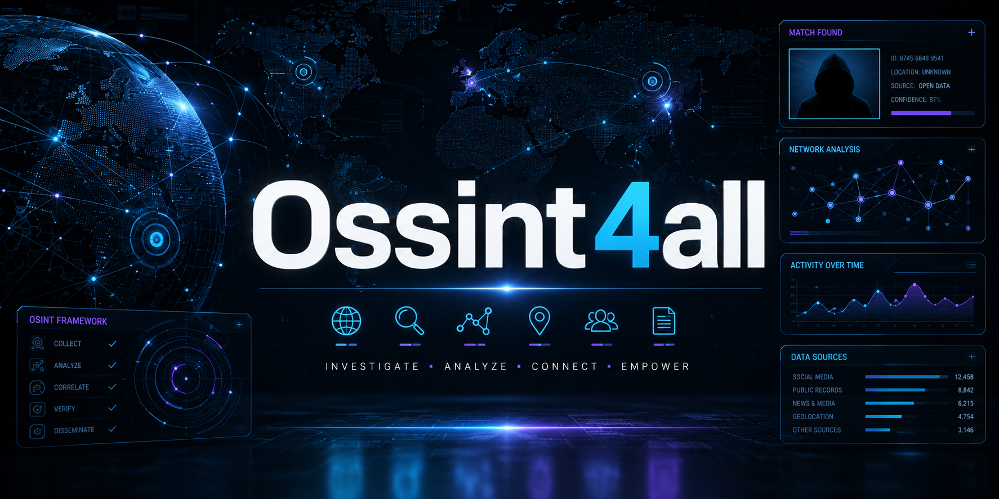

<p align="center">
  
</p>

# OSINT4ALL


Plataforma de investigação OSINT em grafo. Você entra com CPF, CNPJ, nome, e-mail, telefone, usuário ou **placa**; conectores consultam **fontes públicas e APIs oficiais** e montam a rede de vínculos com citação de origem.

Uso previsto: jornalismo investigativo. Não consulta DETRAN, cartório, operadora, bases vazadas nem perfis privados.

## O que faz

- **Alvo**: dossiê em camadas (nome, CPF, CNPJ, placa…). Nome sozinho é candidato; QSA ou identificador forte confirma. Dá para desligar um nó e as ligações
- Consulta avulsa e **busca em massa** (um dado → correlatos) sem criar caso; dá para atribuir o resultado ao caso corrente
- Suíte embutida (Sherlock/WhatsMyName, crt.sh, FOCA/PDF, placa, sócio): roda no painel, sem abrir GitHub nem outro site
- Grafo de pessoas, empresas, processos, perfis públicos, veículos (placa) e publicações
- Placa: série histórica de 1º emplacamento e vínculo `PROPRIETARIO` se você informar o nome/CPF (o DETRAN não publica o dono só com a placa)
- Rede societária pelo nome do sócio (base aberta da Receita): empresas, QSA, CNAE, Simples/MEI, endereço e vistas Rede / Árvore / Split / Mapa
- Expansão por profundidade (sócios → outras empresas → menções)
- DJEN e DataJud como conectores de processo/publicação
- TSE, Transparência, OpenCorporates, Wikidata, busca web (SearXNG público, Brave ou Google CSE) e checagem de URL pública
- Relatório HTML/PDF com citações `[n]`, hash, finalidade e responsável
- Qualidade de evidência: provenance, resolução de entidade, timeline, tarefas, veredito e saúde das fontes
- Segunda geração: playbooks, hipóteses, gap analysis, caminho no grafo, clusters, memória entre casos e nota de qualidade do dossiê
- Mapa de ferramentas no modelo do [OSINT Framework](https://osintframework.com/) (árvore expansível + ramo Brasil / [OSINT Brazuca](https://github.com/osintbrazuca/osint-brazuca))
- Anexo de PDF na investigação para ler metadados (estilo FOCA, só o arquivo que você envia)
- Auditoria de quem buscou o quê

O que diferencia o dossiê de uma lista de conectores é responder: de onde veio o dado, quando foi coletado, qual a confiança, o que contradiz e como reproduzir a conclusão.

| Camada | No painel |
|---|---|
| Provenance | Fonte, URL, método, HTTP, timestamp, hash e captura |
| Entity resolution | Score por âncora (CPF/CNPJ/e-mail) vs nome |
| Evidence graph | Entidades + vínculos + evidências no grafo |
| Timeline | Eventos persistidos no Quadro e na ficha |
| Case management | Casos, notas, tarefas e responsável |
| Verification | Confirmado / provável / não confirmado / contestado / falso |
| Snapshot | HTML do host conhecido em `data/captures/` |
| Change detection | “O que mudou” no Quadro e no monitor |
| AI analyst | Síntese só com citações `[n]` |
| Source health | Fontes → Checar agora (`health()`, sem scan) |
| Legal/privacy | Finalidade, classificação, retenção (sem apagar sozinho) |
| Reports | HTML/PDF com capa, veredito, tarefas e anexos |

## Instalação

```powershell
cd OSINT4ALL
python -m venv .venv
.\.venv\Scripts\activate
pip install -r requirements.txt
pip install -e .
copy .env.example .env
# edite .env — UI_ADMIN_PASSWORD, DATAJUD_API_KEY, etc.
python -m osint4all.main init-db
python -m osint4all.main serve
```

Painel: http://localhost:8000/login (padrão `admin` / senha do `.env`).

Worker e agenda (opcional, se `EXPAND_SYNC=false`):

```powershell
python -m osint4all.main worker
python -m osint4all.main schedule
```

## Testes

```powershell
pytest -q
```

## Fontes

| Conector | Precisa de chave | Observação |
|---|---|---|
| `cnpj_receita` | não | Minha Receita / BrasilAPI |
| `datajud` | chave pública CNJ | capa e movimentos |
| `djen` | não | Comunica API; egress Brasil |
| `tse` | não | candidaturas públicas |
| `transparencia` | `TRANSPARENCIA_API_KEY` | CEIS / CNEP |
| `opencorporates` | token opcional | empresas globais |
| `wikidata` | não | ficha pública |
| `web_search` | não (SearXNG) | instâncias públicas; opcional Brave / Google CSE / `SEARXNG_URL` |
| `username_public` | não | GET em URL canônica pública (GitHub, X, YouTube…) |
| `crtsh` | não | nomes em certificados públicos ([crt.sh](https://crt.sh/)) |
| `plate_public` | não | placa em menção pública; sem DETRAN |
| `socio_search` | `BRASIL_IO_API_TOKEN` opcional | QSA por nome; CPF só com token |
| `diario_oficial` | não | Querido Diário (município/estado) |
| `geo_public` | não | ViaCEP + Nominatim no endereço do QSA |
| `rdap_public` | não | titular público do domínio (não Gmail) |
| `shodan_public` | `SHODAN_API_KEY` | API oficial: hostname/org. Sem scrape, sem CVE |
| `host_public` | não | Wayback / HackerTarget / urlscan (estilo theHarvester) |
| `email_public` | não | Keybase + Gravatar (estilo Holehe, sem leak) |
| `phone_public` | não | DDD/cidade ANATEL (estilo PhoneInfoga, sem operadora) |
| `aleph_public` | não | API pública Aleph/OCCRP. Sem CPF |
| `censys_public` | `CENSYS_API_ID` + `CENSYS_API_SECRET` | Search API oficial. Sem FOFA scrape |
| `host_observe` | não | Ficha do host já conhecido: status, título, tech, security.txt, links do domínio. Índice local estilo IVRE |
| `google_public` | não | Scholar / News / Maps / YouTube públicos. Sem cookie GHunt |

## Mapa de ferramentas

`/app/ferramentas` carrega a árvore pública do [OSINT Framework](https://osintframework.com/) (cache em `data/osint_framework.json`), acrescenta **Brasil · oficiais** (portais do [OSINT Brazuca](https://github.com/osintbrazuca/osint-brazuca)), a **Suíte local (T)** (Sherlock, WhatsMyName, [Mr.Holmes](https://github.com/Lucksi/Mr.Holmes), [FOCA](https://github.com/ElevenPaths/FOCA), [SpiderFoot](https://github.com/smicallef/spiderfoot), user-scanner) e omite pastas de dados vazados, dark web e exploits.

## O que entrou e o que ficou de fora

| Fonte | No OSINT4ALL |
|---|---|
| [OSINT Brazuca](https://github.com/osintbrazuca/osint-brazuca) | Portais oficiais/públicos no mapa (CNJ, TSE, CNA, CEIS, Jucesp…). Sem CPF por força bruta nem captcha. |
| [user-scanner](https://github.com/kaifcodec/user-scanner) | Mais templates de URL pública no conector `username_public`. Sem módulos de breach / Hudson Rock. |
| [FOCA](https://github.com/ElevenPaths/FOCA) / [ExifTool](https://github.com/exiftool/exiftool) | Metadados do PDF/JPEG/PNG **anexado** no caso. Sem varrer a web. |
| [Mr.Holmes](https://github.com/Lucksi/Mr.Holmes) | Só link T (instale localmente). |
| [awesome-osint-arsenal](https://github.com/rawfilejson/awesome-osint-arsenal) | Mesma ideia de catálogo; não instalamos o script de red team. |
| [Babel Street](https://www.babelstreet.com/solutions/strategic-threat-intelligence) | Só referência de UX (grafo + monitoramento). Sem telemetria móvel. |
| [Toutatis](https://github.com/megadose/toutatis), [yesitsme](https://github.com/0x0be/yesitsme) | **Não.** Exigem `sessionid` do Instagram. |
| [DarkSearch](https://github.com/DarkSearchApp/DarkSearch), [dark-web-osint-tools](https://github.com/apurvsinghgautam/dark-web-osint-tools), [IntelX](https://intelx.io/) | **Não.** Dark web / leaks. |
| [ShodanSpider](https://github.com/shubhamrooter/ShodanSpider) | **Não o script.** Raspa o HTML e busca CVE. Só a [API oficial](https://developer.shodan.io/api) com `SHODAN_API_KEY`. |
| [SpiderFoot](https://github.com/smicallef/spiderfoot) | Modelo de conectores + massa + crt.sh. Sem o daemon. |
| [LinkScope](https://github.com/AccentuSoft/LinkScope_Client) | Equivale ao grafo Rede/Árvore/Split. Sem o desktop. |
| [Recon-ng](https://github.com/lanmaster53/recon-ng) | Equivale aos conectores + Explodir. Sem o CLI. |
| [theHarvester](https://github.com/laramies/theHarvester) / [Amass](https://github.com/owasp-amass/amass) / [Subfinder](https://github.com/projectdiscovery/subfinder) | Conector `host_public` (índices passivos). Sem brute de DNS. |
| [Sherlock](https://github.com/sherlock-project/sherlock) / [Maigret](https://github.com/soxoj/maigret) | Ferramenta Redes sociais (URL canônica + templates extras). |
| [Holehe](https://github.com/megadose/holehe) | Keybase + Gravatar. Sem HIBP e sem lista de leak. |
| [PhoneInfoga](https://github.com/sundowndev/phoneinfoga) | DDD, cidade e tipo. Sem operadora. |
| [Aleph](https://github.com/alephdata/aleph) | API pública OCCRP. Sem self-host. |
| [Uncover](https://github.com/projectdiscovery/uncover) | Só Shodan/Censys com API oficial. Sem FOFA. |
| [GHunt](https://github.com/mxrch/GHunt) | Scholar/News/Maps/YouTube públicos. Sem cookie. |
| [Photon](https://github.com/s0md3v/Photon) | Até 8 links da homepage de um domínio já no caso. Sem crawl profundo. |
| [httpx](https://github.com/projectdiscovery/httpx) | Um GET HTTPS no host conhecido: status, título, Server. Sem lista/porta. |
| [Nuclei](https://github.com/projectdiscovery/nuclei) | Só security.txt e sitemap. Sem CVE/DAST. |
| [IVRE](https://github.com/ivre/ivre) | Índice local (histórico + correlação) das fichas permitidas. Não dispara scan. |
| [ZGrab2](https://github.com/zmap/zgrab2) / [Masscan](https://github.com/robertdavidgraham/masscan) | Parser de JSON importado com hostname. Sem coleta ativa. |
| [ZMap](https://github.com/zmap/zmap) | **Não.** Internet-wide scanning. |

## Docker

```powershell
docker compose up --build
```

## Railway

Mantenha o projeto que já tem Postgres e o domínio. Não crie outro.

1. **Source Repo** = `P2FU2/Script_Jus` (não `P2FU2/Ossint4all`). Branch `main`.
2. Não mexa no `DATABASE_URL` do plugin Postgres.
3. Variáveis antigas (`RESEND_*`, `EMAIL_*`, `API_TRIGGER_TOKEN`, `CNA_*`, `DJEN_HISTORICAL_*`) podem ficar — o app ignora.
4. Confirme estas (já usadas no Script_Jus; complete se faltar):

| Variável | Valor |
|---|---|
| `ENV` | `production` |
| `UI_ADMIN_USER` | seu usuário |
| `UI_ADMIN_PASSWORD` | senha do painel (atualiza o admin no boot) |
| `UI_SESSION_SECRET` | string longa (não deixe `change-me-ui-session-secret`) |
| `EXPAND_SYNC` | `true` |

Opcionais: `DATAJUD_API_KEY`, `TRANSPARENCIA_API_KEY`, `SEARXNG_URL`, `SEARXNG_INSTANCES`, `BRAVE_SEARCH_API_KEY`, `GOOGLE_CSE_API_KEY`, `GOOGLE_CSE_CX`, `BRASIL_IO_API_TOKEN`, `SHODAN_API_KEY`, `CENSYS_API_ID`, `CENSYS_API_SECRET`. Menções web usam SearXNG público sem chave; `SEARXNG_URL` aponta a sua instância.

5. Custom Start Command: `python -m osint4all.main serve --host 0.0.0.0` (sem `--port 8000`; o app usa `$PORT` e também escuta 8000 para o domínio antigo).
6. Em **Settings → Networking**, no domínio `authenticadm.org`, a porta-alvo deve ser **8000** ou **8080** (as duas funcionam). Se o site mostrar "Application failed to respond" com healthcheck verde, mude essa porta para a mesma do log `serve host=0.0.0.0 port=...`.
7. Health check: `/health`. Login: `https://authenticadm.org/login`.

DJEN/Comunica costuma falhar fora do Brasil. CNPJ, TSE, Wikidata e username público seguem ok.

```powershell
python -c "import secrets; print(secrets.token_urlsafe(48))"
```
