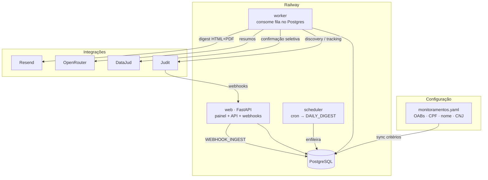
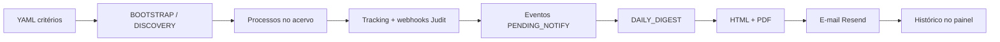
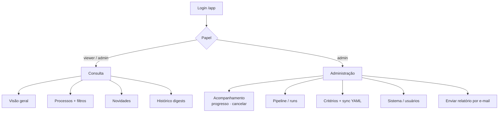

# Monitor Judicial

Serviço automatizado de monitoramento judicial nacional em nuvem, com painel web autenticado.

- **DJEN (Comunica API)** — fonte temporal de novidade (busca nacional por OAB/nome/processo + sweep complementar)
- **DataJud** — enriquecimento/reconciliação de capa e movimentos (não detecta publicação)
- **OpenRouter** — resumos (com fallback determinístico)
- **Resend** — e-mail digest HTML
- **Painel** — consulta do acervo + administração (jobs, critérios, cancelamento)

STF: descoberta via DJEN + link oficial; sem DataJud e sem scraping HTML.

## Como funciona hoje

Webhooks e refresh alimentam eventos o dia todo. O e-mail **não** é disparado por webhook: é um **digest** (cron ou sob demanda pela UI), com corpo HTML e anexos HTML/PDF.



### Fluxo de dados



### Papéis e painel



## Arquitetura de deploy

```
Railway / Docker
├── web        → FastAPI (painel /app + /health /ready /run /webhooks/judit /metrics)
├── worker     → consome jobs (fila no banco) — use 1 réplica
├── scheduler  → enfileira DAILY_DIGEST via cron
└── PostgreSQL → produção  |  SQLite → desenvolvimento local
```

| Serviço | Função |
|---------|--------|
| `web` | Painel, login, API de trigger, webhook Judit |
| `worker` | Executa BOOTSTRAP, discovery, digest, ingest, refresh |
| `scheduler` | Cron → `DAILY_DIGEST` (dias úteis por padrão) |

## Jobs principais

| Tipo | Função |
|------|--------|
| `BOOTSTRAP` | Sync YAML + discovery baseline; eventos históricos **não** vão ao digest |
| `HISTORICAL_DISCOVERY` | Sync YAML + discovery (novidades notificáveis) |
| `WEBHOOK_INGEST` | Normaliza webhook Judit → eventos |
| `PROCESS_REFRESH` / `RECONCILIATION` | Atualiza processos conhecidos |
| `DAILY_DIGEST` | Portfolio + resumos + HTML/PDF + e-mail |
| `DELIVERY_RETRY` | Reenvia digest já gerado |

**Regras operacionais**

- Bootstrap e Discovery **não** devem rodar em paralelo (bloqueio na UI/API).
- Jobs `RUNNING` sem heartbeat são cancelados automaticamente (worker morto/redeploy).
- Admin pode **cancelar** run/job pela UI; o worker para no próximo CNJ/critério.
- OAB no YAML deve bater com a inscrição do tribunal (ex.: `2556/RJ`, sem sufixo `A` se o DJE não usa `A`).

## Painel web

Acesse `https://<seu-dominio>/login` (local: `http://localhost:8000/login`).

### Consulta (admin e viewer)

- **Visão geral** — KPIs do acervo, Por OAB / tribunal, timeline, tooltips
- **Processos** — filtros (CNJ, tribunal, OAB `2556/RJ`, situação oficial, resultado auxiliar)
- **Novidades** — eventos após a leitura inicial
- **Histórico** — digests enviados + download HTML/PDF

### Administração (só admin)

- **Acompanhamento** — progresso ao vivo, disparar jobs (Digest, Discovery, Bootstrap, Refresh…), **cancelar**
- **Pipeline** — stages, runs recentes, cancelar run/job, dead letter
- **Critérios** — lista do banco + preview do YAML; **Sincronizar YAML** (migra variantes OAB, ex. `2556A`→`2556`)
- **Sistema** — flags, usuários
- **Enviar relatório por e-mail** — digest sob demanda para destinatário(s) informados (sem depender do cron)

Variáveis do painel:

```
UI_SESSION_SECRET=...          # obrigatório em produção
UI_ADMIN_USER=admin            # cria o 1º usuário se a tabela users estiver vazia
UI_ADMIN_PASSWORD=...          # obrigatório em produção no primeiro boot
UI_SESSION_HOURS=72
```

Papéis: `admin` (opera) e `viewer` (somente leitura).  
`API_TRIGGER_TOKEN` é só para automação (`POST /run`), não é o login do painel.

## Requisitos

- Python 3.12+
- Conta Judit (módulos contratados) + chave `api-key`
- Chave pública DataJud (CNJ) — [wiki de acesso](https://datajud-wiki.cnj.jus.br/api-publica/acesso/)
- OpenRouter (opcional) e Resend

## Instalação local

```bash
python -m venv .venv
# Windows:
.venv\Scripts\activate
pip install -r requirements.txt
pip install -e .

copy .env.example .env
copy config\monitoramentos.example.yaml config\monitoramentos.yaml
# edite .env e monitoramentos.yaml

python -m monitor_jus.main init-db
```

## Configuração

### Monitoramentos

Edite `config/monitoramentos.yaml`:

```yaml
monitoramentos:
  oabs:
    - numero: "138094"
      seccional: "SP"
      responsavel: "Nome"
    - numero: "2556"          # use a inscrição real (DJE); evite sufixo A se o tribunal não usa
      seccional: "RJ"
      responsavel: "Nome"
  nomes:
    - "Nome Completo"
```

Depois do deploy: **Admin → Critérios → Sincronizar YAML**. A tela mostra as OABs lidas do arquivo vs. o que está no banco.

### Flags Judit (default `false`)

Habilite **somente** o que estiver no contrato:

```
JUDIT_ENABLE_HISTORICAL_SEARCH=true
JUDIT_ENABLE_OAB=true
JUDIT_ENABLE_CPF_CNPJ=true
JUDIT_ENABLE_NAME=true
JUDIT_ENABLE_PROCESS_TRACKING=true
JUDIT_ENABLE_DJEN=true
```

### DataJud

`DATAJUD_API_KEY` é a **chave pública** do CNJ. Em 401/403 o sistema pede atualização da chave.  
Política seletiva: `config/datajud_policy.yaml`.

### Webhook Judit

```
JUDIT_WEBHOOK_AUTH_MODE=static_token   # none|static_token|hmac|ip_allowlist
JUDIT_WEBHOOK_TOKEN=...
```

Em `ENV=production`, `none` é **proibido**.

### Resend (e-mail)

```
RESEND_API_KEY=re_...
RESEND_MAX_CONCURRENCY=1
EMAIL_FROM=Monitor Judicial <onboarding@resend.dev>
EMAIL_TO=seu@email.com,outro@email.com
```

O digest envia corpo HTML e anexos (`.html` + `.pdf`). Pela UI admin dá para enviar para outro destinatário sem alterar o cron.

## Execução

Três processos (ou Docker Compose):

```bash
python -m monitor_jus.main serve
python -m monitor_jus.main worker
python -m monitor_jus.main schedule
```

Bootstrap histórico (baseline **sem** flood de novidades no digest):

```bash
python -m monitor_jus.main bootstrap
# com worker rodando — ou use o botão Bootstrap no painel admin
```

Digest manual (CLI):

```bash
python -m monitor_jus.main run DAILY_DIGEST
```

API:

```bash
curl -X POST http://localhost:8000/run ^
  -H "Authorization: Bearer change-me" ^
  -H "Idempotency-Key: digest-manual-1" ^
  -H "Content-Type: application/json" ^
  -d "{\"run_type\":\"DAILY_DIGEST\"}"
```

Webhook: `POST /webhooks/judit` — valida auth, persiste payload, responde 200 e enfileira `WEBHOOK_INGEST`.

## Docker Compose (local / SQLite)

```bash
docker compose up --build
```

## Produção (Railway)

1. Provisionar **PostgreSQL**
2. `DATABASE_URL=postgresql+psycopg://...`
3. `ENV=production`
4. `UI_SESSION_SECRET`, `UI_ADMIN_USER`, `UI_ADMIN_PASSWORD`
5. Três serviços: `web`, `worker`, `scheduler` — **1 réplica de worker**
6. Deploy inclui `config/monitoramentos.yaml` (sync na UI após mudar OABs)
7. Webhook Judit → `https://<app>/webhooks/judit`
8. Painel → `https://<app>/login`

Ver também `docker-compose.prod.yml`.

### DJEN 403 no Railway (egress Brasil via Tailscale)

A Comunica API bloqueia IP fora do BR. Solução: proxy no PC + Tailscale.

1. **PC** (Tailscale conectado): `scripts/start_djen_egress_proxy.ps1` ou  
   `python -m monitor_jus.sources.djen.egress_proxy` → porta `8899`
2. Anote o IP: `tailscale ip -4` (ex.: `100.64.1.2`)
3. **Worker Railway** na mesma tailnet (`TS_AUTHKEY`) e start  
   `scripts/start_worker_with_tailscale.sh`
4. Env do worker: `DJEN_HTTP_PROXY=http://100.64.1.2:8899`
5. Teste: `python -m monitor_jus.sources.djen.probe` → deve ser **200**


## Agendamento

```
SCHEDULE_CRON=0 7 * * 1-5
TZ=America/Sao_Paulo
```

`SCHEDULE_HOUR` é fallback se o cron estiver vazio.

## Correções e comportamentos recentes

| Tema | Comportamento atual |
|------|---------------------|
| OAB RJ `2556A` vs `2556` | YAML e sync usam a inscrição real; busca Judit tenta variante sem letra; painel liga processos pelas partes |
| Por OAB baixo vs total | Conta CNJs com a OAB no registro DJEN ou vínculo. Processos só por nome (sem OAB no DJEN) ficam de fora. Sincronize Critérios para religar o histórico. Tribunal ≠ seccional da OAB. |
| Situação oficial | Inferida da capa/movimentações (Extinto, Em grau de recurso…); filtro em Processos |
| Jobs zumbis | `RUNNING` sem heartbeat → cancelados; UI mostra “Travado” |
| Cancelar na UI | Admin cancela run/job em Pipeline e Acompanhamento |
| Digest sob demanda | Campo de e-mail + “Enviar relatório” (HTML+PDF) |
| Sync YAML | Preview do arquivo na tela Critérios; falha de backfill não desfaz o sync |
| Tooltips | Balões fixos (não cortam nos cards) |
| Progresso | % / ETA / critério X/Y · CNJ A/B no Acompanhamento e nos logs |

## Exclusão LGPD

```bash
python -m monitor_jus.main purge 00000000000
```

## Checklist comercial Judit

Antes de produção, confirme na proposta:

- consulta histórica por múltiplas OABs
- CPF / CNPJ / nome
- monitoramento de novos processos e movimentações
- DJEN (e o que **não** cobre fora do DJEN)
- STF / TJs / TRFs desejados
- webhooks + autenticação + histórico
- limites, preços, retenção, anexos, sandbox/Postman, SLA

## Disclaimer

O sistema consolida os eventos encontrados nas fontes habilitadas. A disponibilidade e o horário dos dados dependem da publicação e do processamento de cada tribunal e fornecedor. Publicações via DJEN e o início do monitoramento podem ter latência. Não há garantia de cobertura instantânea ou absoluta.

## Testes

```bash
pytest -q
```
